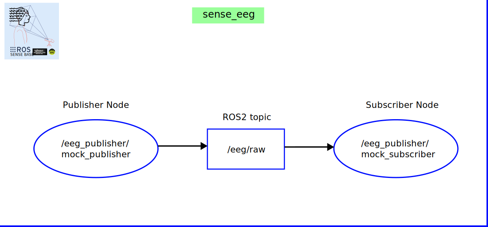

<div style="text-align: center;" align="center">
  
  <h1> sense_eeg </h1>
</div>

## :eyeglasses: Overview

`sense_eeg` is a ROS 2 (Humble) package that provides a publisher node for streaming EEG data as EEGBlock messages defined in `sense_msgs`. It is designed to interface with live EEG acquisition hardware or synthetic/mock data sources, and integrates smoothly with downstream ROS 2 components.

## :school_satchel: Getting started
* :computer: [Setting up ROS2 with docker container](https://github.com/sense-base/base/tree/main/docs/docker)

* :octocat: Clone repo under `sense-base` path and refer to the [CONTRIBUTING](CONTRIBUTING.md) guideline for detailed instructions on contributing to this repo. Create the directory `workspace/src`. Clone `sense_eeg` package into the `workspace/src`:

```bash
mkdir sense-base && cd sense-base
git clone git@github.com:sense-base/base.git
cd base
mkdir workspace/src
# Clone this eeg_publisher package
git clone git@github.com:sense-base/sense_eeg.git
# Clone the eeg_msgs package
git clone git@github.com:sense-base/sense_msgs.git
# Also clone bridge if you plan to convert between NumPy and EEGBlock
git clone git@github.com:sense-base/sense_bridge.git
```

* :nut_and_bolt: Run and debug. Open a terminal into the loaded container in VSCode using the dev containers extension, and run

```bash
colcon build --symlink-install
source install/setup.bash
ros2 launch eeg_publisher mock_publisher_launch.py
```

* Useful Debugging Tools (Optional)
On a different terminal, run

```bash
ros2 topic list             # Verify /eeg/raw is available
ros2 topic echo /eeg/raw    # See the raw published message
rqt_graph                   # Visualize node/topic connections
```

* If you’d like to record and replay EEG traffic:

```bash
ros2 bag record /eeg/raw
ros2 bag info <bag_file>
ros2 bag play <bag_file>
```
